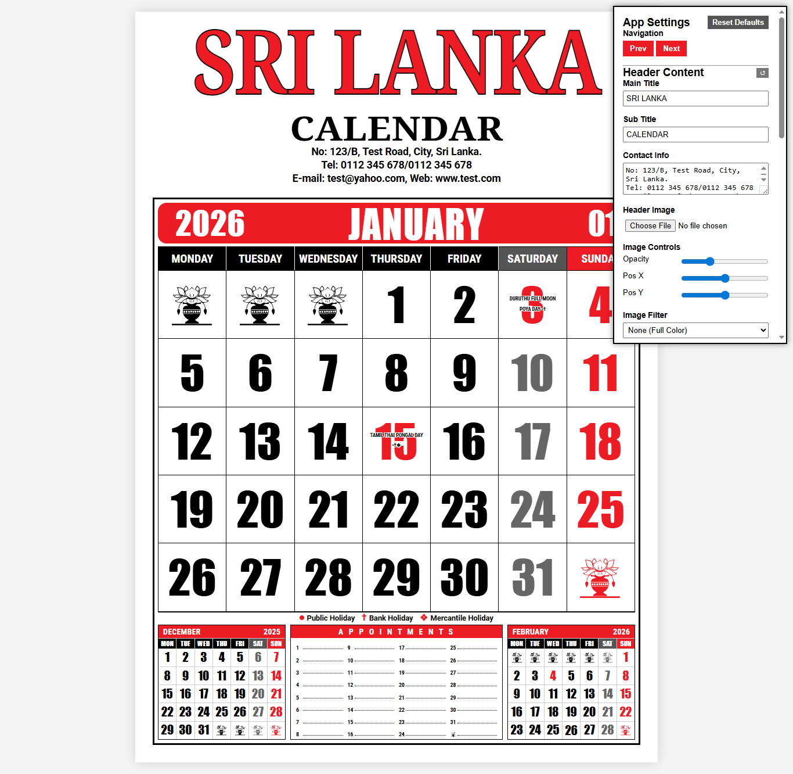

# Sri Lanka Calendar Generator

A powerful, customizable web-based calendar generator specifically designed for Sri Lanka, featuring automatic holiday integration, printable A4 vector calendars, and extensive customization options.

[Sri Lanka Calendar App Screenshot]<br>




## 🌐 Live Demo

Try the tool directly in your browser!  
👉 [Click here to see the live demo](https://nuwan-jk.github.io/srilanka-classic-calendar-maker/)

---

## 🌟 Features

### 📅 Core Functionality
- **Automatic Calendar Generation**: Generates complete 2026 calendars with proper Sri Lankan holidays
- **Holiday Integration**: Pre-loaded with all official Sri Lankan public holidays, bank holidays, and mercantile holidays
- **Custom Holidays**: Add your own custom events and holidays with click-to-edit functionality
- **Interactive Interface**: Click on dates to add holiday titles, click on empty cells for personal notes

### 🎨 Customization Options
- **Header Customization**: Fully customizable title, subtitle, and contact information
- **Background Images**: Upload and position background images with opacity and filter controls
- **Color Schemes**: Adjustable primary colors (red, black, grey) for branding
- **Typography Controls**: Font sizes, weights, positions, and text outlines for holidays
- **Icon Options**: Choose from default Sri Lankan cultural icons, custom images, or text symbols

### 🖨️ Print & Export
- **A4 Vector Printing**: High-quality, scalable vector output optimized for A4 paper
- **Single Month Print**: Print the current month view
- **Full Year Print**: Generate and print all 12 months in one go
- **PDF Export**: Uses html2canvas and jsPDF for professional PDF generation

### 📱 Responsive Design
- **Desktop Optimized**: Fixed-width layout designed for desktop printing
- **Mobile Compatible**: Responsive controls that work on all devices
- **Print Optimization**: Special print styles ensure perfect A4 output across devices

## 🎨 Color Palette

The app uses a carefully selected color palette that reflects Sri Lankan national colors and ensures excellent print quality:

| Color | Hex Code | Usage |
|-------|----------|-------|
| <span style="color:#ed1c24;">■</span> Primary Red | `#ed1c24` | Main titles, holidays, accents |
| <span style="color:#000000;">■</span> Text Black | `#000000` | Primary text, borders |
| <span style="color:#666666;">■</span> Text Grey | `#666666` | Secondary text, Saturday highlighting |

## 🚀 Quick Start

1. **Clone the repository**:
   ```bash
   git clone https://github.com/yourusername/sri-lanka-calendar-generator.git
   cd sri-lanka-calendar-generator
   ```

2. **Open in browser**:
   - Simply open `index.html` in any modern web browser
   - No server required - works completely offline

3. **Customize and Print**:
   - Use the control panel on the right to customize appearance
   - Navigate months with Prev/Next buttons
   - Click "Print Current Month" or "Print All 12 Months"

## 📖 Usage Guide

### Adding Holidays
- Click on any date cell to add a custom holiday title
- Pre-loaded holidays are automatically displayed with appropriate symbols:
  - ● Public Holiday
  - † Bank Holiday
  - ❖ Mercantile Holiday

### Adding Notes
- Click on empty cells (containing icons) to add personal notes
- Notes are displayed in a clean, readable format

### Header Customization
- Upload background images for branded calendars
- Adjust opacity, position, and apply filters (grayscale, sepia, duotone)
- Customize all text elements with color, size, and positioning controls

### Printing Tips
- Use "Print Current Month" for single-page calendars
- Use "Print All 12 Months" for complete year overview
- Output is optimized for A4 paper with proper scaling
- Colors are preserved exactly in print (no color adjustment)

## 🛠️ Technical Details

### Technologies Used
- **HTML5**: Semantic markup with SVG icons
- **CSS3**: Advanced styling with CSS custom properties
- **Vanilla JavaScript**: No frameworks, lightweight and fast
- **html2canvas**: For screenshot generation
- **jsPDF**: For PDF creation and export


## 🤝 Contributing

Contributions are welcome! Please feel free to submit a Pull Request.

1. Fork the repository
2. Create your feature branch (`git checkout -b feature/AmazingFeature`)
3. Commit your changes (`git commit -m 'Add some AmazingFeature'`)
4. Push to the branch (`git push origin feature/AmazingFeature`)
5. Open a Pull Request

## 📄 License

This project is licensed under the MIT License - see the [LICENSE](LICENSE) file for details.

---
- Inspired by traditional Sri Lankan calendar printing practices
